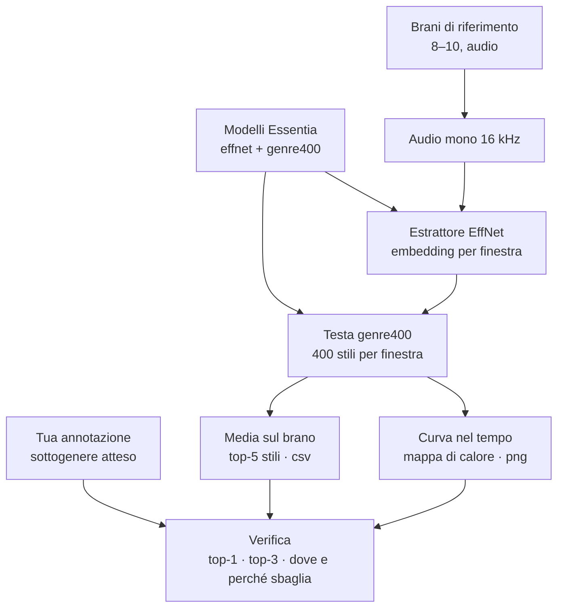

# Prova C01 — genere e sottogenere con Discogs-EffNet

## Domanda

Discogs-EffNet riconosce i sottogeneri dei miei brani metal e rock strumentali? In questo primo giro si usa il modello **così com'è**, senza addestrare niente. L'obiettivo è capirlo e usarlo correttamente.

## Il modello in breve

- **Tipo**: rete convoluzionale EfficientNet-B0 che legge lo spettrogramma mel come un'immagine. Addestrata su circa 3,3 milioni di brani (dataset interno Discogs-4M) con gli stili Discogs.
- **Due pezzi**: l'estrattore `discogs-effnet-bs64-1` (audio → embedding di 1.280 numeri per finestra) e la testa `genre_discogs400-discogs-effnet-1` (embedding → 400 stili).
- **Input**: mono, **16 kHz**. Con una frequenza sbagliata il modello non dà errore, dà risultati sbagliati.
- **Finestre**: 128 bande mel × 96 frame, circa 1,5 s *(stima, da verificare: durata e sovrapposizione)*.
- **Uscite**: sigmoide, cioè **stili indipendenti** che non sommano a 1. Etichette nel formato `Genere---Stile`.
- **Metriche dichiarate**: ROC-AUC 0,954 · PR-AUC 0,206. Gli stili rari sono probabilmente poco precisi.
- **Stili rilevanti presenti**: Sludge Metal, Doom Metal, Funeral Doom Metal, Post-Metal, Post Rock, Progressive Metal, Math Rock, Drone.
- **Licenza**: CC BY-NC-SA 4.0 (non commerciale, i modelli non si ridistribuiscono).

## Disegno

**Scelte già prese**
- **Si annota prima di far girare il modello**: per ogni brano, sottogenere atteso più un secondo accettabile, con i nomi Discogs.
- **Si salvano gli embedding** per riusarli: voce/strumentale, classificatore proprio (C02), intensità.
- **Due letture dell'output**: la media dice *cosa è* il brano, la curva *dove il modello cambia idea*.

## Grafico: stili nel tempo (mappa di calore)

- **Righe**: i 6–8 stili con la media più alta sul brano (non tutti e 400).
- **Colonne**: le finestre; asse in minuti e secondi, calcolato dalla durata reale delle finestre.
- **Colore**: probabilità da 0 a 1, un solo colore di intensità crescente.
- **Sotto**: le sezioni del brano annotate a mano (intro pulita, picco…), se disponibili.
- **Due versioni**: grezza e lisciata (media mobile su poche finestre), almeno al primo giro.
- **Perché non "la categoria vincente per finestra"**: con uscite indipendenti salterebbe tra stili vicini (sludge ↔ doom) e nasconderebbe quanto il modello è sicuro.

## Verifica

| Controllo | Come |
|---|---|
| Top-1 | lo stile atteso è il primo della media? |
| Top-3 | lo stile atteso (o il secondo accettabile) è tra i primi tre? |
| Errori | dove sbaglia nel tempo e perché (intro pulite, passaggi lenti, qualità della registrazione) |
| Finestre | numero di uscite rispetto alla durata → durata e sovrapposizione reali |

## Risultati attesi (file in questa cartella)

- `C01-predizioni.csv`: brano, top-5 stili con probabilità media
- `C01-<brano>-stili-nel-tempo.png`: mappa di calore, grezza e lisciata
- `C01-embedding/`: embedding per brano **fuori da git** se pesanti (da decidere)

## Decisioni aperte

1. Quali 8–10 brani di riferimento (strumentali, sottogenere noto; idealmente sludge e post-metal).
2. Brani interi o solo un estratto (es. i primi 2 minuti).
3. Soglia minima di probabilità sotto cui dire «il modello non sa».
4. Dove tenere gli embedding (in `data/` fuori da git, o piccoli in questa cartella).

## Ambiente

Sul PC dell'utente, in WSL (Essentia non ha pacchetti per Windows nativo). I modelli vanno in `models/` (vedi `models/README.md`), i brani in `data/riferimento/`.

## Cosa ho visto

_(da compilare dopo il primo giro)_

## Fonti

- Essentia, catalogo modelli: https://essentia.upf.edu/models.html
- Scheda estrattore: https://essentia.upf.edu/models/feature-extractors/discogs-effnet/discogs-effnet-bs64-1.json
- Scheda testa: https://essentia.upf.edu/models/classification-heads/genre_discogs400/genre_discogs400-discogs-effnet-1.json
- Alonso-Jiménez, Serra, Bogdanov, *Music Representation Learning Based on Editorial Metadata from Discogs*, ISMIR 2022
